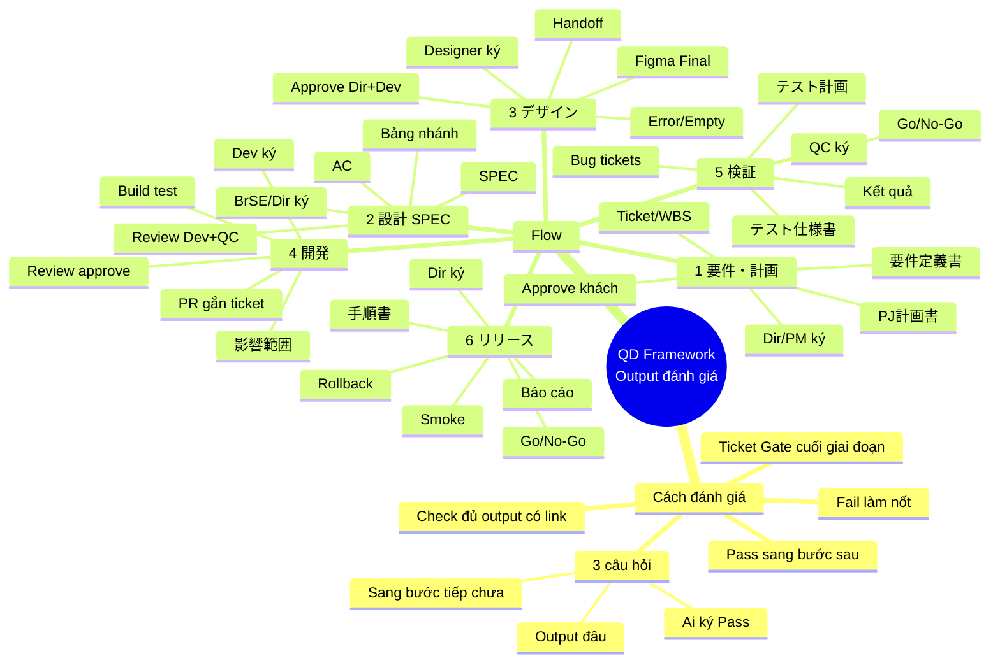

# QD Framework — Output đánh giá chuẩn theo giai đoạn

## Flow vận hành (nhìn 10 giây)

```
要件・計画 → 設計SPEC → デザイン → 開発 → 検証 → リリース
     ↓           ↓          ↓        ↓       ↓         ↓
  Gate Pass   Gate Pass  Gate Pass Gate Pass Gate Pass  Đóng release
```

**Cách đánh giá:** cuối mỗi giai đoạn mở **1 Ticket Gate** → check đủ output → **Pass mới được sang bước sau**.  
Thiếu output / còn bug High = **Fail** → làm tiếp, không nhảy giai đoạn.

| Quy tắc | Ý nghĩa |
|---|---|
| Output | Phải có **link cụ thể** (file, ticket, Figma, PR, Sheet) |
| Pass | Đủ output + điều kiện cứng bên dưới |
| Fail | Thiếu output, hoặc còn Blocker/High chưa xử lý |
| Ai ký | 1 người chịu trách nhiệm giai đoạn đó |

### Mindmap (tóm tắt)



---

## 1. 要件定義・PJ計画書

**Mục tiêu:** Chốt làm gì / không làm gì / khi nào xong.  
**Người ký Gate:** Dir / PM

| # | Output cần có | Đủ khi nào |
|---|---|---|
| 1 | 要件定義書 | Có In scope / Out scope, mục tiêu, actor |
| 2 | PJ計画書 | Có milestone + ngày + người phụ trách |
| 3 | Ticket/WBS trên Backlog | Đã tách task, có estimate sơ bộ |
| 4 | Xác nhận khách (approve) | Có ngày + người + link note/comment |

**Pass khi:** khách đã chốt yêu cầu + kế hoạch; không còn câu hỏi Blocker.  
**Chưa Pass nếu:** scope mơ hồ (“làm thêm nếu kịp”), chưa có ngày milestone.

→ Sang **設計 SPEC**

---

## 2. 設計（画面仕様書 SPEC / 設計書）

**Mục tiêu:** Viết đủ để Dev code và QC test, không phải hỏi lại.  
**Người ký Gate:** BrSE / Dir *(Dev + QC đã review)*

| # | Output cần có | Đủ khi nào |
|---|---|---|
| 1 | 画面仕様書 (SPEC) | Có field, validation, lỗi, quyền, flow màn |
| 2 | AC (tiêu chí nghiệm thu) | Mỗi chức năng có Given–When–Then hoặc checklist rõ |
| 3 | Bảng trạng thái / nhánh | Các case chính (role, status, điều kiện) đã ghi |
| 4 | Review record | Dev + QC đã review; issue High = 0 |

**Pass khi:** SPEC đã khóa version; Dev/QC review xong; không còn TBD ở logic chính.  
**Chưa Pass nếu:** chỉ mô tả UI, thiếu lỗi/validation; AC kiểu “hoạt động bình thường”.

→ Sang **デザイン** (UI) và/hoặc **開発**

---

## 3. デザイン

**Mục tiêu:** Figma đúng SPEC, đủ trạng thái để Dev làm.  
**Người ký Gate:** Designer *(Dir + Dev approve)*

| # | Output cần có | Đủ khi nào |
|---|---|---|
| 1 | Figma Final | Đủ màn trong scope, đánh dấu Final/Approved |
| 2 | Các state cần thiết | Ít nhất: bình thường + Error + Empty |
| 3 | Handoff | Link frame ↔ SPEC; copy/text chính thức |
| 4 | Approve | Dir xác nhận đúng nghiệp vụ; Dev xác nhận làm được |

**Pass khi:** design khớp SPEC; không còn placeholder; Dev không còn hỏi thiếu state/copy.  
**Chưa Pass nếu:** chỉ có happy path; lệch SPEC chưa có Change Request.

→ Sang **開発**

---

## 4. 開発

**Mục tiêu:** Code đúng SPEC/Design, bàn giao test được.  
**Người ký Gate:** Dev Lead / Dev chính

| # | Output cần có | Đủ khi nào |
|---|---|---|
| 1 | PR gắn Backlog ticket | 1 PR = rõ đang làm ticket nào |
| 2 | Code review approve | ≥ 1 người khác approve; High comment = 0 |
| 3 | 影響範囲メモ | Ghi màn/API bị ảnh hưởng (hoặc “không có”) |
| 4 | Build trên môi trường test | Có version/commit; QC biết test ở đâu |

**Pass khi (Ready for QA):** AC chính Dev đã tự check; PR merged/deploy test; không bug High do chính thay đổi này.  
**Chưa Pass nếu:** merge không review; “xong” nhưng QC không biết build nào.

→ Sang **検証**

---

## 5. 検証

**Mục tiêu:** Có số liệu chứng minh đủ điều kiện release / UAT.  
**Người ký Gate:** QC

| # | Output cần có | Đủ khi nào |
|---|---|---|
| 1 | テスト計画 | Phạm vi test, lịch, môi trường, tiêu chí Pass |
| 2 | テスト仕様書 | Case map theo AC + regression ảnh hưởng |
| 3 | Kết quả chạy test | % đã chạy, Pass/Fail, gắn version build |
| 4 | Bug tickets | Có severity, bước tái hiện, expected/actual |
| 5 | 品質サマリー | Số bug theo mức; kết luận **Go** hoặc **No-Go** |

**Pass khi:**
- Critical / Blocker = **0**
- High = **0** (muốn để lại phải có waiver + Dir/khách duyệt)
- 100% case In-scope đã chạy

**Chưa Pass nếu:** “test xong” không có số; chỉ test happy path.

→ Sang **リリース** (khi Go)

---

## 6. リリース

**Mục tiêu:** Lên production an toàn, có cách rollback, có xác nhận sau release.  
**Người ký Gate:** Dir / Release owner

| # | Output cần có | Đủ khi nào |
|---|---|---|
| 1 | Go/No-Go | Có người duyệt + thời điểm + version |
| 2 | リリース手順書 | Từng bước deploy + ai làm |
| 3 | Rollback計画 | Khi nào rollback, làm thế nào |
| 4 | Smoke test production | Case tối thiểu sau deploy = Pass |
| 5 | Báo cáo hoàn tất | Giờ xong, version thực tế, gửi Slack/stakeholder |

**Pass khi:** đã Go trước khi deploy; smoke Pass; có báo cáo đóng release.  
**Chưa Pass nếu:** deploy không có rollback; không smoke sau lên prod.

→ Đóng release / theo dõi 24–72h

---

## Ticket Gate dùng thế nào? (1 phút)

Mỗi cuối giai đoạn = **1 ticket** tên ví dụ: `Gate: 検証`.

Trong ticket chỉ cần:

1. Dán link các output ở bảng trên  
2. Tick đủ / thiếu  
3. Người ký ghi: `Pass` hoặc `Fail` + ngày  

**Pass** → chuyển giai đoạn tiếp.  
**Fail** → ghi mục thiếu, làm nốt, đánh giá lại trên cùng ticket Gate.

---

## Bảng tra nhanh (in / pin Slack)

| Giai đoạn | Output tối thiểu | Người ký | Điều kiện cứng |
|---|---|---|---|
| 要件・計画 | 要件 + 計画 + ticket + approve khách | Dir | Hỏi Blocker = 0 |
| 設計 SPEC | SPEC + AC + review Dev/QC | BrSE/Dir | Khóa version; High = 0 |
| デザイン | Figma Final + Error/Empty + approve | Designer | Khớp SPEC |
| 開発 | PR + review + 影響範囲 + build test | Dev | Ready for QA thật |
| 検証 | Kế hoạch + case + kết quả + Go/No-Go | QC | Critical/High = 0 |
| リリース | Go + 手順 + Rollback + smoke + báo cáo | Dir | Smoke Pass |

---

## Từ không dùng khi đánh giá

| Tránh nói | Nói thay |
|---|---|
| “Ổn / cơ bản xong” | “Đủ output 1–4; thiếu mục …” |
| “Chất lượng tốt” | “Pass rate X%; High open = N” |
| “Đã trao đổi rồi” | “Link note/approve ngày …” |
| “Để sau” | “Out of scope” hoặc “CR #ticket” |

---

**Nguyên tắc 1 câu:**  
*Mỗi giai đoạn chỉ trả lời 3 ý — Output đâu? Ai ký Pass? Được sang bước tiếp chưa?*
