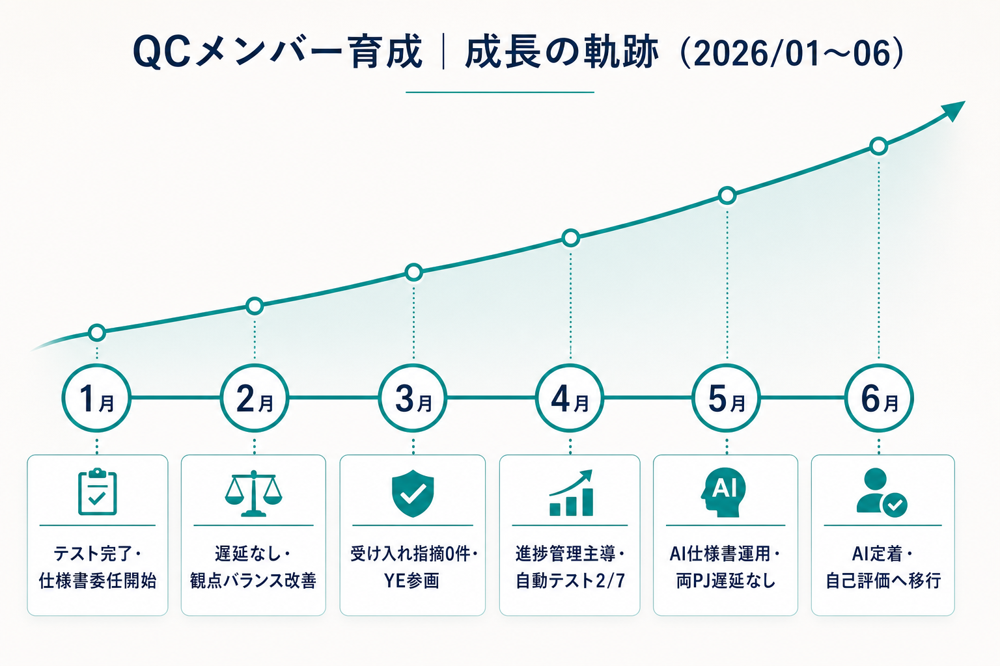

# 社員ID_氏名（所属）｜A2（H1）最終活動報告

**氏名: マイ グエン バオ チャウ**  
**所属・役職：所属評価期間： A2H1 (2026/01-06)**  
**レポート対象期間：2026/01〜2026/06**

## レポートの目的

本レポートは、半期目標（OKR/MBOなど）に基づいた月次計画とその実行を振り返ることで、戦略的な行動の継続と成果の最大化を目的とします。上長との対話に活用し、チームと個人の学び・改善につなげていきます。

#### 提出タイミング

レポートは1on1の前日までに提出し、上長が事前に確認した上で対話の質を高めます。

#### 追記・修正の反映

1on1後に得られた気づきやフィードバックを反映し、最終版として更新してください。

#### 評価観点

評価については、本レポートや関係者からのフィードバック、コンピテンシー要件等に基づき総合的に判断します。

## 1. 半期目標の確認

### 自分の半期目標（OKRやMBO）

※定性／定量それぞれ

- QCメンバーの育成
- WDP：利益率 40%
- ディレクター業務の推進と顧客コミュニケーションの強化
- Refa：利益率 40%

### 全社・所属事業との接続

※この目標がどのように全社方針や部門戦略につながるか

品質の安定提供と利益率の確保により、顧客満足と事業収益の両立を目指す。QCメンバー育成によりチームの品質体制を強化し、ディレクター業務の推進により顧客接点と案件推進力を高める。

## 2. 今期の計画（対象期間：2026/01〜06）

### 今期の目標（半期目標に基づく分解目標）

※例：プロジェクトX要件定義完了、○件受注、CVR改善など

- QCメンバーの育成
- WDP：利益率 40%
- ディレクター業務の推進と顧客コミュニケーションの強化
- Refa：利益率 40%

### 予定していた主なアクション・タスク

※予定している施策やアウトプットなど

**1/ QCメンバーの育成**

- 対象：ピーちゃん
- 目的：新人メンバーへの説明やフォローを自律的に行えるレベルを目指す。
- ステップアップ：テスト計画の策定・進捗管理の習得、テスト仕様書の観点強化、最終チェック精度の向上。
- テスト仕様書作成／テストスケジュール管理の委任とレビュー
- 自動テスト導入のリサーチ〜運用開始
- AIを活用したテスト仕様書作成の導入
- 報連相能力の向上フォロー
- REFA参画後のロジック理解支援・フロー作業の委任

**2/ WDP：利益率 40%**

- 工数入力の誤り防止（チケットへの工数付け先明記、日次確認強化）
- 仕様書作成時の網羅性向上により、作業完了後の修正を最小化
- 開発・テスト改善提案の継続
- 受け入れ不具合0件の継続

**3/ ディレクター業務の推進と顧客コミュニケーションの強化**

- 全体WBSのフォローおよび進捗管理（QC／開発両面）
- チーム内への情報共有・展開範囲の拡張
- 迅速な回答・対応、打合せ内容の記録徹底
- 保守消化進捗報告・検収書対応など業務範囲の拡大
- 上流（見積・要件）段階からのロジック漏れ防止

**4/ Refa：利益率 40%**

- 保守案件のタスク管理
- 商品カスタム等のテスト計画・仕様書確認・レビュー強化
- 遅延防止のためのスケジュール管理

### 懸念点・リスクとその対策

※達成を阻む要因と、それに対する仮説・対応策など

- テスト工数超過／見積と実績の差分 → 自動テスト導入、見積再確認、追加工数相談の徹底
- 要望相違・認識齟齬 → 仕様書精緻化、先方ヒアリング強化、図解による認識合わせ
- 報連相不足による既存ロジック変更 → 業務フロールール化、実装前の影響範囲確認
- 次期タスク減少（6月） → ヴィス様訪問等を通じ主動的な提案・タスク創出

### 必要な支援／事前に相談したいこと

※判断が欲しいこと、関係者調整など

特になし（6月利益率は確定後に追記予定）

## 3. 実績と振り返り

### 今期の成果・アウトプット（定量／定性）

※目標達成状況や成果物など

**1/ QCメンバーの育成**

**【達成サマリー】**

ピーちゃんを対象に、テスト計画・進捗管理・仕様書作成・レビュー対応まで段階的に委任。半期を通じて「一人で品質チェックできる範囲」を拡大し、AI活用・自動テストにも挑戦させた。

**■ 成長の軌跡（月次）**

- 1月：1月分のテスト対象をスケジュール通り遅延なく完了。最終品質チェックでのバグ検出は2件に抑え、重大な欠陥や漏れを抑制。2月リリースに向けたテスト仕様書・スケジュールの作成を委任開始。
- 2月：スケジュール通り遅延なしで検証完了。ロジック検証に偏り、一部UIの不具合を見落とす課題が発生したため、検証観点のバランス最適化を指導。Slack等でのコミュニケーションは非常に積極的。
- 3月：リセット機能の検証にて「受け入れ指摘0件」を達成。別プロジェクト（YE）のテストサポートにも参画。リリース手順書に基づくテスト観点の作成や、リリース内容のリストアップ業務へ初めて対応。
- 4月：サブ設問設定の検証WBS作成、テスト仕様書作成、および進捗管理を主導。自動テストの運用を開始し、対象画面（ログイン、トップ、アカウント、稼働分析など）の2/7画面の自動化を完了。
- 5月：WDP／REFA両PJにおいてテスト遅延なし。AIを活用したテスト仕様書作成の運用を開始し、作成時間の削減および新たな検証観点の獲得に寄与（レビュー強化は継続課題）。
- 6月：AIによるテスト仕様書作成手法をチーム内で実装済みとして定着。報連相のフォローを強化。次期に向けて「できること／できないことの自己評価」を目標に組み込み、自立した月次報告ができるよう移行準備を推進。

**■ 関係者フィードバック（半期総括）**

**【Mikuさんより】**

＜ピーちゃんのいいところ＞

- チケット記載やSlackでのコミュニケーションが丁寧 → エンジニアが調査しやすい
- 素直に前向きに業務に取り組む姿勢
- ロジカルな部分もキャッチアップできている

＜A2で成長したこと＞

- 仕様に対するキャッチアップ粒度が向上し、検証ケースの観点・委任できる範囲が増加
- 国内エンジニアとの協働機会で、しっかりコミュニケーションが取れていた
- 報・連・相が改善され、円滑に仕事ができるようになった
- AI活用などモダンな技術にも挑戦している

＜これから期待したいこと＞

- 日本語スキルアップの継続
- 細かい仕様のキャッチアップ（仕様書読解力の向上）
- QC部分を1人で担当できる範囲の拡大
- Charles／ProxyMan等のプロキシツールを用いた検証
- アプリ分野の検証への挑戦

**【Mikaさんより】**

■よかった点

- 検証観点が的確である
- チケット起票の内容がわかりやすい
- 検証精度が高い
- 不明点があれば、すぐに確認できる

■改善点

- 積極的に日本語で発言すること（言葉は話さないと上達しない）
- 「報・連・相」を徹底すること（仕事の基本）

**【育成としての所感】**

半期を通じ、丁寧なコミュニケーション・検証精度・前向きな姿勢が周囲から評価される水準まで成長。報連相・仕様キャッチアップ・日本語発言は継続課題として来期もフォローする。

**2/ WDP：利益率 40%**

**【利益率の推移】**

目標：40%

- 2026/1月単体：55.3%（達成）
- 2025/12＋2026/1合算：36.1%（未達）
- 2026/2月：-65.9%（未達）
- 2026/3月：53.6%（達成）
- 2026/4月：46.8%（達成）
- 2026/5月：65.6%（達成）
- 2026/6月：※確定後に追記予定

→ 1月単体および3〜5月は目標40%を上回って推移。2月は大幅マイナスとなったが、3月以降は回復・安定（5月は65.6%まで改善）。

**【リリース内容と受け入れテスト結果】**

**■ 2月リリース**

- ログインUIの改善
- 共通IDにおけるサーベイ回答率の向上
- アカウント管理（クライアントタブ内）のアカウント数表示の改修
- → 受け入れテストより指摘件数：0件
- → 先方イメージとの相違なく本番反映完了

**■ 3月リリース**

- メンテナンスモードの実装
- リセット機能
- → リセット機能：受け入れテストより指摘件数：0件
- 開発環境構築：先方指摘は多数あったが、多くは不具合ではなく既存ロジック起因。先方観点をテスト仕様書へ反映し再発防止。

**■ 4月（リセット機能関連の振り返り）**

- 受け入れテストより指摘件数：0件
- ただしリリース後に漏れ1件（バッチ処理エラー）を検知し、急遽修正リリースを実施
- → 対策：QC振り返りMTG実施、影響範囲チェック観点を追加

**■ 5〜6月リリース**

- サブ設問設定 → 受け入れテストより指摘件数：0件
- 既存不具合2件への対応 → 受け入れテストより指摘件数：0件
- 部署ごとのサーベイ結果絞り込み機能（Mikaさん担当）
- → 6月リリース完了。リリース後1週間の運用で問題なしとの先方確認を受領。請求手続き連携へ移行。

**【品質面の総括】**

主要リリースにおける受け入れテスト指摘は概ね0件を継続。品質目標は安定してクリアし、リリース遅延もなし。4月のリリース後漏れ1件を除き、顧客受け入れ品質は高水準を維持。

**【受け入れ指摘件数一覧】**

- 2月リリース（ログインUI改善／サーベイ回答率向上／アカウント数表示改修）：0件
- 3月リリース（リセット機能）：0件
- 4月（リセット機能・受入）：0件 ※リリース後に漏れ1件（バッチ処理エラー）→修正リリース済
- 5〜6月リリース（サブ設問設定）：0件
- 5〜6月リリース（既存不具合2件対応）：0件

**【利益面の総括・改善アクション】**

- 工数入力誤り防止、見積再確認、追加工数相談の徹底を実施
- 3月：開発環境構築でテスト工数超過 → 利益に影響
- 4月：保守調査（ログイン不可等）・瑕疵対応で工数超過 → 利益に影響しつつも月次利益率は46.8%で達成
- 自動テスト導入（ログイン／トップ／アカウント等）により、来期のテスト工数削減を推進中

**3/ ディレクター業務の推進と顧客コミュニケーションの強化**

**【進捗・成果】**

- 1〜3月：各月リリースをスケジュール通り完了。認識相違による誤作動・手戻りは発生なし。
- 業務範囲拡大：保守消化進捗報告、検収書周りへの対応を開始。
- 上流強化：見積・要件定義段階から実装必要ロジックの漏れ防止を徹底し、手戻り・工数削減を目指した。
- 4月：開発過程で既存ロジックが意図せず変更される事象が発生 → 報連相不足を課題共有し、業務フロー見直し・周知を実施（実装前の影響範囲確認、顧客合意後の着手をルール化）。
- 5〜6月：開発・検証遅延なし。レスポンス速度を意識し「同じ確認を2回させない」対応を徹底。
- 6月：ヴィス様訪問により今後方針・要望を把握。主動的な提案・タスク創出に着手。次期開発タスク減少リスクへの先行対応を実施。

**【成長ポイント】**

画面仕様書作成・読み合わせなどクライアント前での会話機会が増加。保守窓口・Dirサブとしての推進力が強化された。

**4/ Refa：利益率 40%**

**【利益率】**

現在はリリース準備段階のため、利益率の結果はまだ出ていない（リリース後に計測・報告予定）。

**【品質・進捗（受け入れテスト中心）】**

- 4月：保守案件のタスク管理を担当。報告漏れ・検証遅延防止のための管理強化を開始。
- 5月：商品カスタムのテスト計画・仕様書確認／作成／レビューを強化。スケジュール通り・遅延なし。
- 6月：
  - 受入テストを実施。要望・指摘への対応をほぼ完了し先方へ報告済み（6/19時点）。報告書上、指摘件数の明示数値は未記載のため、件数は「要望・指摘対応完了」として品質管理を実施。
  - モンキーテスト、返却チケット確認、リリース用検証パターン作成、納品用ドキュメント作成を推進
  - リリース作業は7月に延期 → 延期期間中に事前準備タスクを継続対応
- → 利益目標の数値達成は未確定だが、品質面では受入テスト対応を完了させ、リリース遅延なく準備を進めている状態。

### 目標とのギャップとその要因

※うまくいかなかった理由や、予期せぬ障害

- WDP利益率：2月は-65.9%と大幅未達。工数超過・瑕疵対応等が要因。3月以降は回復したが、月次での振れ幅は残る。
- WDP品質：受け入れ0件は継続できたが、4月にリリース後漏れ1件が発生。影響範囲観点の不足が要因 → 観点追加済み。
- Refa利益率：リリース未完了のため、今期中の利益率達成判定は保留。
- QC育成：委任範囲は拡大したが、1人完結・プロキシツール・アプリ検証・日本語発言は来期継続課題。

### 得られた学び・気づき

※次につながる示唆や個人的な発見

- 修正箇所がなくても既存ロジックへの影響確認は必須（影響範囲チェックの徹底）
- 品質の高さは利益につながる一方、工数超過・瑕疵は利益を押し下げる → 上流での漏れ防止と追加工数相談の両立が重要
- 報連相と顧客合意前の実装着手禁止が、意図しないロジック変更の再発防止に直結する
- AI活用は作成速度を上げるが、インプット精度とレビュー品質が成果を左右する
- タスク減少局面では、待ちではなく主動提案がDirとしての価値になる

## 4. チーム・プロジェクトでの関わり方

### 役割・成果

※主担当、サポート、育成などの具体的な関わりなど

役割: QC、サブDirector／BrSE

- 品質担保に加え、やり取りタスク・ロジック確認・進捗管理をサポート
- ピーちゃん育成（仕様書レビュー、進捗管理委任、AI／自動テスト導入支援）
- WDP／Refa両PJのDirサブおよび品質管理として推進

### チームとの連携・雰囲気

※連携のしやすさ、コミュニケーション、改善の余地など

- 開発・QC間の認識合わせ（図解、必要時の集合解決）を強化
- 報連相ルールの明文化により、意図しない変更の抑制を推進
- 国内エンジニアとの協働機会を通じ、ピーちゃんのコミュニケーション成長を後押し

## 5. 改善と来期のチャレンジ

### 業務・プロセス上の課題

構造的な課題、改善余地のある点

- 利益率の月次振れ（特に工数超過・瑕疵時）
- リリース後漏れの再発防止（影響範囲観点の定着）
- AIテスト仕様書のレビュー負荷
- 次期開発タスクの確保・主動提案力
- QCメンバーの1人完結範囲のさらなる拡大

### 打った／打つ予定の改善アクション

※施策・取り組み・相談予定など

- 自動テスト運用の強化（運用計画・スクリプトデモ作成に着手）
- 工数入力確認・見積再確認・追加工数相談の継続
- 顧客への早期レスポンスと詳細概要の共有徹底
- ピーちゃん：自己評価報告の定着、プロキシツール／アプリ検証への挑戦支援
- Refa：7月リリースに向けた事前準備の完遂と、リリース後の利益率計測

### 来期の注力事項（Next Action）

※半期目標に向けた次のステップ

- WDP：利益率40%の安定達成（月次振れの抑制）＋受け入れ指摘0件の継続
- Refa：リリース完了後の利益率40%達成と品質維持
- QC育成：1人で担当できる機能範囲の拡大、日本語発言・報連相のさらなる強化
- Dir：主動提案によるタスク創出、顧客コミュニケーションの質・速度の向上
- PM／Dirサブとしての新規案件への継続参画

## 6. その他（任意）

部門横断の取り組み、提言、上長への相談など

- 6月利益率は確定次第追記する
- 来期目標のマイルストーン／アクションプランを詳細化し実行に移す

## 7. 上長コメント

### 所感・コメント

### 来期へのアドバイス・期待すること

評価者（上長）：　　　　レポート承認日：

※レポート承認日は上長が内容が充実していることを確認した上で記載をお願いします。
